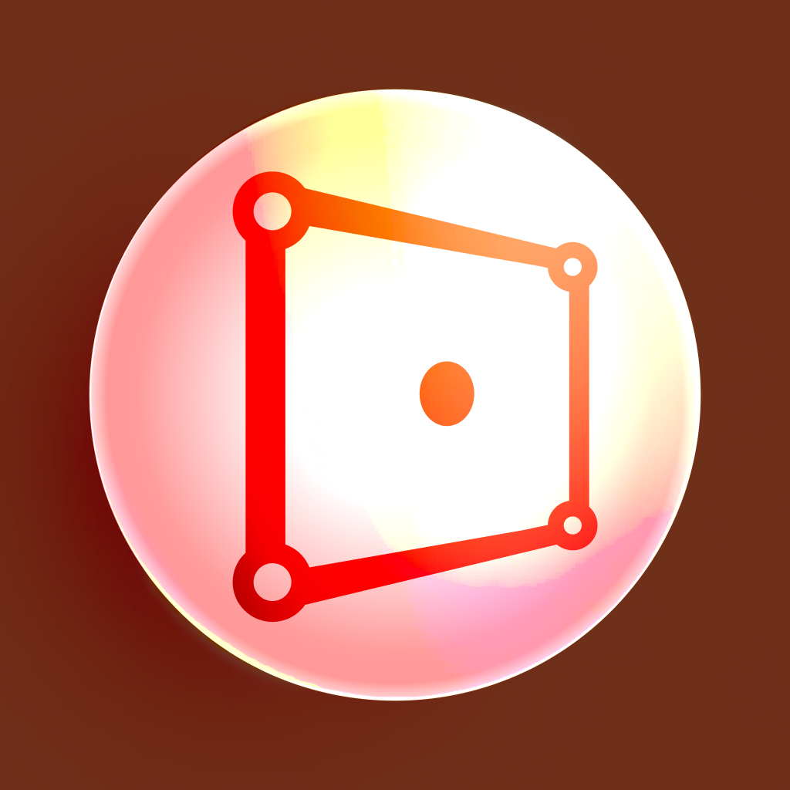

<br>
# Mesh Rotate
<i>Rotate an object using the mesh points</i> <br>
### Version 2.0.0.6

[](https://github.com/skymen/mesh3DRotate_sdkV2/releases/download/skymen_mesh_rotate-2.0.0.6.c3addon/skymen_mesh_rotate-2.0.0.6.c3addon)
<br>
<sub> [See all releases](https://github.com/skymen/mesh3DRotate_sdkV2/releases) </sub> <br>

---
<b><u>Author:</u></b> skymen <br>
<b>[Construct Addon Page](https://www.construct.net/en/make-games/addons/1273/mesh-3d-rotate)</b>  <br>
<b>[Documentation](https://www.construct.net/en/make-games/addons/1273/mesh-3d-rotate/documentation)</b>  <br>
<sub>Made using [CAW](https://marketplace.visualstudio.com/items?itemName=skymen.caw) </sub><br>

## Table of Contents
- [Usage](#usage)
- [Examples Files](#examples-files)
- [Properties](#properties)
- [Actions](#actions)
- [Conditions](#conditions)
- [Expressions](#expressions)
---
## Usage
To build the addon, run the following commands:

```
npm i
npm run build
```

To run the dev server, run

```
npm i
npm run dev
```

## Examples Files
| Description | Download |
| --- | --- |
| Basic Usage | [](https://github.com/skymen/mesh3DRotate_sdkV2/raw/refs/heads/main/examples/Basic%20Usage.c3p) |

---
## Properties
| Property Name | Description | Type |
| --- | --- | --- |
| Rotate X | Rotate X | float |
| Rotate Y | Rotate Y | float |
| Rotate Z | Rotate Z | float |
| Use New Size | Use New Size | check |
| Width | Width | float |
| Height | Height | float |


---
## Actions
| Action | Description | Params
| --- | --- | --- |
| Set Rotation From Vectors | Set the rotation of the object from up and forward vectors | Up X             *(number)* <br>Up Y             *(number)* <br>Up Z             *(number)* <br>Forward X             *(number)* <br>Forward Y             *(number)* <br>Forward Z             *(number)* <br> |
| Set Euler Rotation | Set the rotation of the object from euler angles | Rotation X             *(number)* <br>Rotation Y             *(number)* <br>Rotation Z             *(number)* <br> |
| Set Size | Set the size of the object | Width             *(number)* <br>Height             *(number)* <br> |
| Set Use New Size | Set the use new size of the object | Use New Size             *(boolean)* <br> |
| Sample Action | This is a sample action | Param1             *(string)* <br> |


---
## Conditions
| Condition | Description | Params
| --- | --- | --- |
| Sample Condition | This is a sample condition |  |


---
## Expressions
| Expression | Description | Return Type | Params
| --- | --- | --- | --- |
| getHeight | Get the height of the object | number |  | 
| getWidth | Get the width of the object | number |  | 
| SampleExpression | This is a sample expression | string |  | 
